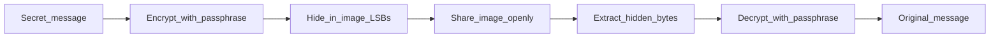

# ARCHIMEDES

[](LICENSE)
[](https://www.python.org/)
[](https://cryptography.io/)
[](https://python-pillow.org/)
[](https://github.com/TomSchimansky/CustomTkinter)

> **Encrypt a secret message. Hide it inside a photograph. Share the image openly.**
> Nobody will know anything is there.

---

## The Concept & Impact

Encryption keeps a message unreadable. It does not keep the message invisible. A locked file, a `.enc` archive, or a password-protected document tells anyone watching that something worth opening is inside. Steganography closes that gap. It hides not only what you wrote, but the fact that you wrote anything at all.

Archimedes is a local desktop tool that puts that idea into practice. You encrypt text with a passphrase, embed the result inside an ordinary image, and pass the photo around like any other file. The image looks unchanged. The secret travels in plain sight. Everything runs on your machine. No accounts, no cloud, no network calls.

---

## How It Works

You pick a cover image, enter a passphrase, and type your message. Archimedes derives an encryption key from your passphrase, encrypts the text, and hides the ciphertext in the least significant bits of the image pixels. The output is a PNG file saved beside the original. To read it back, you open that image, enter the same passphrase, and the app extracts and decrypts the hidden bytes. A wrong passphrase fails with a clear error instead of returning garbage.



- Keys are derived at runtime and never written to disk
- Each encryption uses a fresh random salt
- The app runs fully offline

---

## Quick Start

**Requirements:** Python 3.10 or later, pip.

```bash
git clone https://github.com/yoavyoscovitz-wq/archimedes.git
cd archimedes
python -m venv .venv
# Windows: .venv\Scripts\activate
# macOS / Linux: source .venv/bin/activate
pip install -e .
archimedes
```

**Embed:** Select a cover PNG or JPG, enter your passphrase, type your message, and click *ENC · EMBED*. A `*_cipher.png` file is saved next to the original.

**Recover:** Open the cipher image, enter the same passphrase, and click *DEC · RECOVER*. Your message appears in the text field.

On first launch, a welcome screen walks you through the basics. Click the **`?`** button anytime to open the in-app Help Center. No Docker, API keys, or accounts required.

---

## Behind the Code

Developed by **Yoav Yoscovitz**.

Archimedes grew out of an interest in applied cryptography and privacy tools that people can actually use.

[LinkedIn](https://www.linkedin.com/in/yoav-yoscovitz/) · [GitHub](https://github.com/yoavyoscovitz-wq)

---

## Legal Disclaimer

> **THIS SOFTWARE IS PROVIDED "AS IS", WITHOUT WARRANTY OF ANY KIND, EXPRESS OR IMPLIED.**
>
> Archimedes is an **open-source educational and portfolio project**. It is provided to demonstrate applied concepts in cryptography, steganography, and software design.
>
> The author accepts **no liability** for data loss, security incidents, legal consequences, or any other damages arising from the use, misuse, or inability to use this software.
>
> **You are responsible** for ensuring your use of this tool complies with all applicable laws and regulations. Do not use this software to conceal illegal activity.
>
> See the [MIT License](LICENSE) for full terms.
